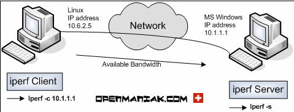

# `iperf` command

`iperf` là công cụ dòng lệnh được sử dụng để đo lượng băng thông tối đa có thể đạt được trên mạng IP. 

Hỗ trợ tính năng điều chỉnh nhiều thông số liên quan tới thời gian, bộ đệm và các giao thức trong quá trinh đo đạc.

Trong thử nghiệm, sử dụng `iperf` để theo dõi các thông số về băng thông, tỉ lệ mất gói và các thông số khác. 

## Tính năng

- Hỗ trợ đo băng thông, kích thước MTU và kích thước gói tin đọc được quan sát. Giám sát thông số kích thước cửa sổ TCP thông qua các socket buffer.

- Hỗ trợ tạo luồng UDP với băng thông cụ thể, đo độ mất gói, độ trễ, hỗ trợ khả năng multicast.

- Được hỗ trợ trên nhiều nền tảng khác nhau: Window, Linux. Android, ...

- Tạo nhiều kết nối từ client và server (với tùy chọn `-P`)

- Có thể hoạt động trong thời gian cụ thể (với tùy chọn `-t`)

- In ra các báo cáo định kì về băng thông, độ mất gói theo chu kì nhất định (tùy chọn `-i`)

- Có thể hoạt động như Daemon (tùy chọn -D)

- ...

## Một số ví dụ

## Tham khảo

[1] https://iperf.fr/

[2] 