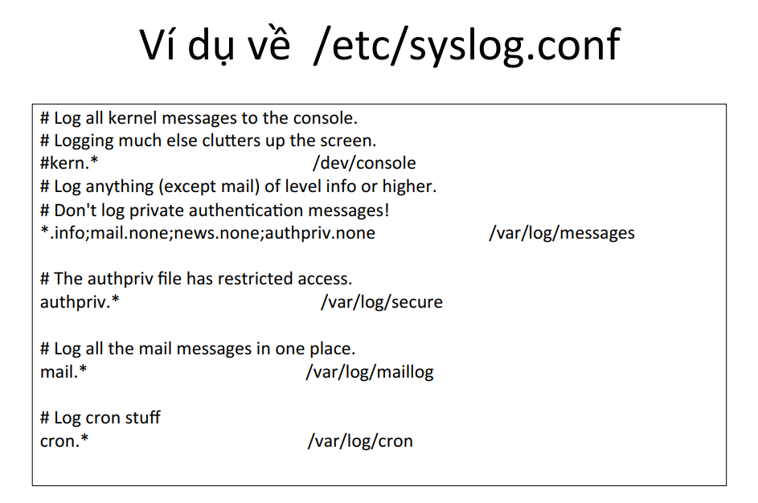
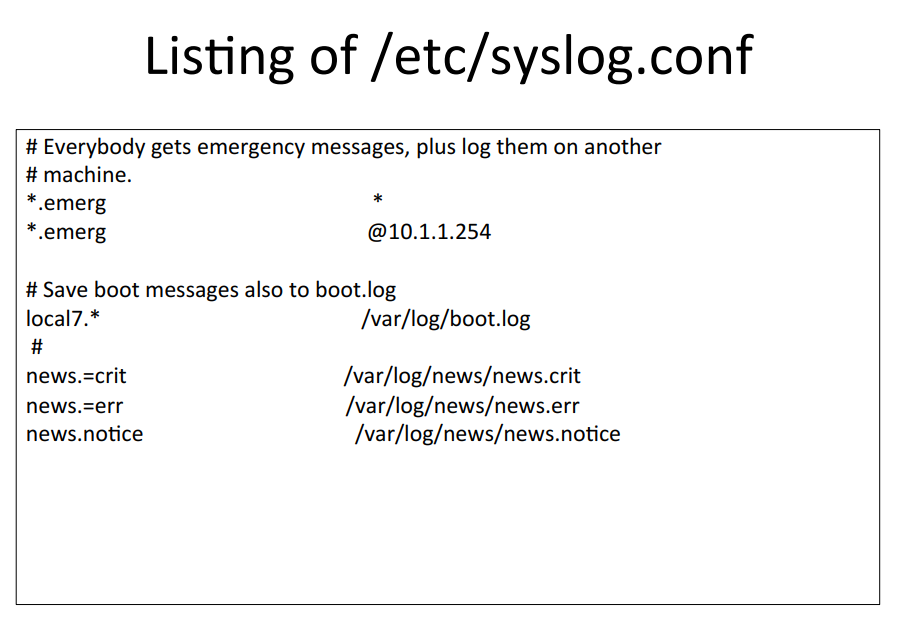

# Một số ghi chép về log trên linux

## 1. Log là gì ?

- Log là nhật ký ghi lại các thao tác đã được thực hiện, các sự kiện đã xảy ra, là tập hợp các thông báo được hệ thống sinh ra và lưu trong tập nhật kí - log file.	

- Tại sao lại cần có log ? => Log ghi lại quá trình hoạt động của hệ thống, nên khi có vấn đề xảy ra, đọc lại log để biết các thao tác tác động tới hệ thống và tìm ra hướng xử lý.

- Các thông báo trong log có thể là: 

	–  Thông báo của hệ thống	

	–  Lỗi trong các thao tác hệ thống

	–  Quá trình đăng nhập, đăng xuất.	

	–  Thông báo từ một số ứng dụng.

## 2. Cơ chế ghi log

Cơ chế ghi log được phân thành 2 kiểu:

- **Độc lập**:

	–  Các ứng dụng tự ghi nhật ký vào các thư mục riêng rẽ

	–  Khó theo dõi các nhật ký

	–  Nhật ký nhân hệ điều hành không phải là ứng dụng

	–  Các ứng dụng khó sử dụng nhật ký của nhau

	–  Khó phát hiện ứng dụng	“có vấn đề”	

- **Tập trung**:

	–  Các ứng dụng gửi thông báo chung cho một ứng dụng chịu trách nhiệm ghi nhật ký

	–  Tùy theo mức độ ứng dụng nhật ký sẽ ghi các thông phù hợp vào nhật ký	

	

## 3. Syslog 

### 3.1. Syslog là gì ?

- Syslog là chương trình quản lý các thông báo từ các thành phần của hệ	thống	

- Được thực hiện bởi **syslogd daemon**.		

- Khởi	động	cùng	hệ	thống

	```
	/etc/init.d/syslog	{	start	|	stop	|	reload	}
	```

- Cấu hình của syslogd được lưu trong file `/etc/rsyslog.conf`

### 3.2. Cấu trúc file syslog.conf

Rsyslogd (có thể hiểu syslogd và rsyslogd tương đương nhau <muốn phân biệt thì tới phần [bonus]() nha :"> >) daemon chịu trách nhiệm thu thập các message service đến từ các ứng dụng và kernel, rồi gửi chúng tới các file log (thường được lưu trong thư mục `/var/log/`). Các tham số cấu hình cho rsyslogd được lưu trong file `/etc/rsyslog.conf`.

- Mỗi message được liên kết với một hệ thống ứng dụng con (gọi là "facility" - hiểu nôm na thì nó là nguồn gốc của bản tin log được sinh ra đó)

	

- Mỗi bản tin log (message) lại được gán độ ưu tiên (mức độ nghiêm trọng - priority) khác nhau. Mức độ nghiêm trọng được liệt kê theo giảm dần theo thứ tự sau: 

	

	- ***emerg***: “Help!” There is an emergency, the system is probably unusable.

	- ***alert***: hurry up, any delay can be dangerous, action must be taken immediately.

	- ***crit***: conditions are critical.

	- ***err***: error.

	- ***warn***: warning (potential error).

	- ***notice***: conditions are normal, but the message is important.

	- ***info***: informative message.

	- ***debug***: debugging message.

### 3.3. Cấu hình file /etc/rsyslog.conf

Quy tắc chung để cấu hình /etc/rsyslog.conf cấu hình cặp “selector” và “action”.

Selector định nghĩa ra các bản tin log liên quan, và action mô tả thao tác đối xử với bản tin log tương ứng.

- Cú pháp Selector: 

	- Selector được phân tách bởi dấu ";" để liệt kê các cặp subsystem.priority (ví dụ: auth.notice;
mail.info). Kí tự "*" đại diện cho mọi hệ thống với tất cả mức ưu tiên (priority) (ví dụ: *.alert or mail.
*). Một số hệ thống có thể được gộp nhóm, phân tách bởi dấu "," (ví dụ:auth,mail.info). Priority để biết được mức độ của bản tin log bằng hoặc cao hơn mức được cấu hình ngay sau facility, do đó nên auth.alert để cấu hình cho các bản tin hệ thống ở mức alert hoặc emerg. 

	- Với tiền tố **"!"** mang nghĩa đảo nghịch lại, hay nói cách khác là dành cho các mức priority thấp hơn. Ví dụ: auth.!notice - tức là sẽ áp cho các bản tin log từ auth với mức priority thấp hơn nó, là info hay debug. 

	- Tiền tố **"="** tương ứng với chỉ mức độ ưu tiên đó. (auth.=notice tức chỉ áp cho các bản tin log auth với mức priority là notice).

	- Mỗi thành phần trong list selector thì sẽ ghi đè lên các thành phần trước đó, nghĩa là sẽ áp dụng mức priority của thành phần cuối cùng. Ví dụ, kern.info;kern.!err nghĩa là bản tin log từ kernel với mức priority ở giữa là từ info trở lên và dưới mức error (tức là info, warn và notice).

	- **None** priority để không thiết lập priority và nó sẽ không nhận các log có priority là none. Ví dụ: *.crit;kern.none sẽ thu thập tất cả các log có priority cao hơn hoặc bằng crit, trừ các log đến từ kernel.

- Cú pháp Actions: Các actions - tác động với message tương ứng trong selector gồm: 

	- Thêm vào một file (ví dụ: /var/log/messages)

	- Gửi message tới một remote syslog server (ví dụ: @log.falcot.com)

	- Gửi tới một named pipe (ví dụ: |/dev/xconsole)

	- Gửi tới một hoặc nhiều user đã login và hệ thống (ví dụ: root,rhertzog)

	- Hoặc gửi tới tất cả các user đang đăng nhập vào hệ thống (ví dụ: *)

	- Viết message ra console (ví dụ: /dev/ty8).

- Việc ghi các log quan trọng ra một máy tách biệt khác là một giải pháp tốt bởi nó sẽ ngăn chặn việc bị xóa log bởi các tác động không mong muốn. Hơn nữa, với các vấn đề xảy ra trong hệ thống, việc có log trên một máy khác sẽ làm tăng  cơ hội tìm được nguyên nhân gây ra sự cố nhanh hơn. Để cho phép các bản tin log được gửi đến từ máy khác, bạn phải cấu hình lại file rsyslog cho hoạt động ở chế độ sẵn sàng nhận log. 
($ModLoad imudp and $UDPServerRun 514).

- Một số ví dụ về cấu hình file /etc/rsyslog.conf:

	

	

- Một số file log mặc định quan trọng trong linux: 

	

## 4. Logrotate

Các file log có thể tăng kích thước nhanh chóng, và cần thiết để lưu lại. Kịch bản thông thường là lưu trữ luân chuyển: các file log được lưu trữ đều đặn, và chỉ giữ lại các bản lưu trữ mới nhất. 

Logrotate là chương trình chịu trách nhiệm cho việc luân chuyển, theo dõi các thư mục được cấu hình trong file /etc/logrotate.conf và tất các các file trong thư mục /etc/logrotate.d/. Người quản trị có thể cấu hình các file này 
Log files can grow, fast, and it is necessary to archive them. The most common scheme is a
rotating archive: the log file is regularly archived, and only the latest X archives are retained.
logrotate, the program responsible for these rotations, follows directives given in the /etc/
logrotate.conf file and all of the files in the /etc/logrotate.d/ directory. The administrator
may modify these files, if they wish to adapt the log rotation policy defined by Debian. The
logrotate(1) man page describes all of the options available in these configuration files. You
may want to increase the number of files retained in log rotation, or move the log files to a
specific directory dedicated to archiving them rather than delete them. You could also send
them by e-mail to archive them elsewhere.
The logrotate program is executed daily by the cron scheduling program (described in section 9.7, “Scheduling Tasks with cron and atd” page 205)

### Bonus: Khác nhau giữa syslog và rsyslog 

Tham khảo tại: https://serverfault.com/questions/692309/what-is-the-difference-between-syslog-rsyslog-and-syslog-ng?rq=1

"These are 3 different kind of log managers : it enables your system to collect filter, and transmit/store logs.

- **Syslog** (daemon also named sysklogd) is the default LM in common Linux distributions. Light but not very flexible, you can redirect log flux sorted by facility and severity to files and over network (TCP, UDP).
- **rsyslog** is an "advanced" version of sysklogd where the config file remains the same (you can copy a syslog.conf file directly into rsyslog.conf and it works) ; but you have a lot of new cool stuff coming with it :

	- You can listen to TCP/UDP/... connections, with restrictions (ports, Source IPs)

	- You can load a lot of modules

	- You can discriminate the log filtering by program, source, message, pid etc. (for instance, each message tagged with the message "connexion closed" to the file closed.log)

	- You can discard message after one or more rules Visit http://www.rsyslog.com which is very good indeed

- **Syslog-ng** is "Next-Gen". I think it's the best way to manage logs : everything is object (source, destination, filter, and the very forwarding rule) and the syntax is clear. I doubt in terms of functionality that rsyslog and syslog-ng are different."

### Tham khảo

[1]

[2]

[3] https://serverfault.com/questions/692309/what-is-the-difference-between-syslog-rsyslog-and-syslog-ng?rq=1