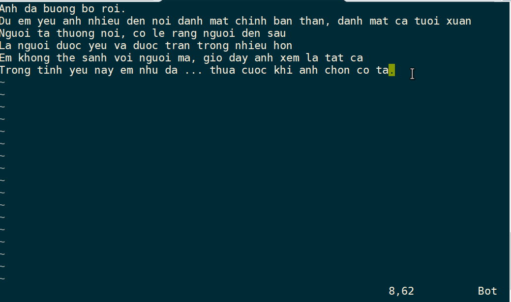
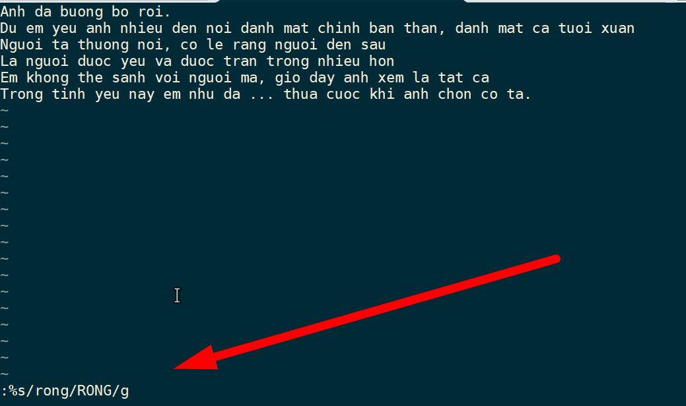
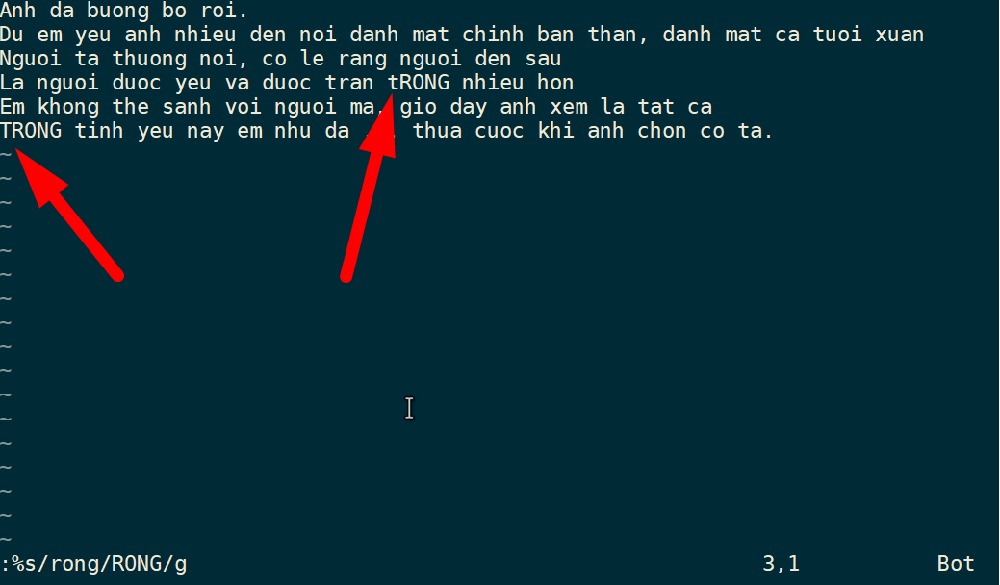

# Một vài tips với vi / vim

### ***Mục lục***

[1) Thao tác insert / comment nhiều dòng cùng lúc](#1)

[2) Thực hiện lệnh sed trong khi đang vi/vim file ](#2)

---

## 1) Thao tác insert / comment nhiều dòng cùng lúc 

 Thực hiện các bước sau: 

1. First, press `ESC`
2. Go to the line from which you want to start commenting. Then, press `ctrl` + `v`, this will enable the visual block mode.
3. Use the `down arrow` ( to select multiple lines that you want to comment.
4. Now, press `SHIFT` + `I` to enable insert mode.
5. Press `#` and it will add a comment to the first line. Then press `ECS` and wait for a second, # will be added to all the lines. 

#### Uncommenting Multiple Lines

1. Press `CTRL + V` to enable visual block mode.
2. Move down and select the lines till you want to uncomment.
3. press `x` and it will uncomment all the selected lines at once.

***Nguồn tham khảo:***  https://discuss.devopscube.com/t/how-to-comment-and-uncomment-multiple-line-vi-terminal-editor/64 

## 2) Thực hiện lệnh sed trong khi đang vi/vim file

Khi thực hiện thao tác với file sử dụng vi / vim, mình có thể thực hiện lệnh sed ngay trong mode edit. 

Ví dụ có file nội dung như sau: 

Trong mode edit này, thực hiện thay cụm **"rong"** thành **"RONG"** như sau: 

- Ấn `ESC` để thoát khỏi chế độ `INSERT`

- Ấn tổ hợp phím : `%s` để vào chế độ sed. Sau đó thực hiện tương tự như lệnh sed thông thường. 

  

- Kết quả được như sau: 

  